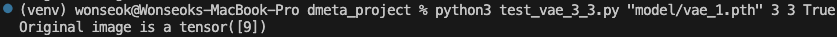

# Reconstructing image from augmented segments
## [2x2]
MNIST 데이터를 활용하여 해당 과제를 시작했습니다.

또한 처음에는 MxN개의 segments의 모든 가능한 permutation과 각 segment에 augmentation (mirror, flip, rotate_90)을 적용한 경우의 수를 고려하는 방법으로 진행하였습니다.

처음에는 각 segment의 edge들 간의 distance가 가장 작은 augmentation을 답안으로 제시하였으나 픽셀 특성상 MNIST의 흰색 숫자 부분이 아닌 검은 바탕 부분 (pixel=0)을 이어붙인 이미지가 정답으로 제시되어 다른 방법 물색했습니다.

### 이진 분류기 활용

이후에 제가 떠올린 방법은 segments들의 모든 edge를 이어붙였을 때 measure를 이진 분류기로 산정하는 방법이었습니다.

무작위 segments들이 주어졌을 때 각 segment에 8가지 augmentation을 모두 적용하고 segments들의 모든 가능한 permutation을 이진 분류기에 넣어 "진짜" 이미지일 확률이 가장 높은 segment permutation을 정답으로 제시하는 방법입니다.

이진 분류기 학습은 원본 MNIST 이미지와 해당 원본 이미지를 MxN segment로 쪼개어 각각의 segment를 augment하여 무작위 순서로 segment를 원본 이미지의 해상도 (MNIST의 경우 28x28)로 이어 붙인 두 종류의 학습 데이터를 구성하여 학습하였습니다.

해당 이진 분류 모델의 pre-trained weights는 model/cnn_model_1.pth입니다.

#### 해당 방법론에 관련된 파일들을 설명드리자면,
  - test_cnn_2_2.py: 학습된 이진 분류기로 augment되거나 되지 않은 (True/False) MNIST 이미지의 원본을 추론합니다.
    - CLI 사용 방법: python3 test_cnn_2_2.py [pre-trained weights path] [M] [N] [원본 이미지를 augment 할지 말지]
    <pre>
    ```bash
    $ python3 test_cnn_2_2.py "model/cnn_model_1" 2 2 True
    ```
  ##### 실행 결과
  - 좌측: 원본 이미지를 4개의 segment로 쪼개고 각 segment를 임의로 augment하여 임의의 순서로 segment들을 이어붙인 이미지
  - 우측: 좌측 augmented 이미지의 원본 추론 결과
  
  - CLI 실행문과 원본 이미지의 MNIST label print
  

  - 좌측: 원본 이미지
  - 우측: 좌측 원본 이미지의 원본 추론 결과
  
  - CLI 실행문과 원본 이미지의 MNIST label print
  

  아래 파일들은 사실 실행하지 않으셔도 됩니다.

  - cnn_model.py: CNN 이진 분류기 모델 클래스가 있습니다.
  - train_cnn_2_2_mnist.py: cnn_model.py 모델 클래스를 MNIST 데이터와 augmented MNIST 데이터를 통해 학습합니다. M과 N을 지정하여 모델을 학습하여야 합니다. M과 N은 2x2까지만 원활히 작동합니다.
    - CLI 사용 방법: python3 train_cnn_2_2_mnist.py [.pth 파일명] [M] [N]
    <pre>
    ```bash
    $ python3 train_cnn_2_2_mnist.py "model/cnn_model_1" 2 2
    ```
    </pre>
  
## [3x3]

### 이진 분류기 활용

2x2까지는 이미지가 augment 될 수 있는 경우의 수가 4x3x2x1x8x8x8x8 (4개의 segment의 permutation 수 * 각 segment의 가능한 augment 조합의 수) = 98,304라서 모두 이진 분류기에 넣고 가장 스코어가 높은 이미지를 뽑으면 됐지만 3x3부터는 경우의 수가 너무 많아져서 다른 방법을 찾아야 했습니다.

### 생성형 모델 활용

그래서 고안한 방법은 변형되거나 변형되지 않은 이미지를 입력으로 넣으면 해당 이미지의 원본을 생성하는 VAE 모델을 학습하는 방법이었습니다.

VAE 모델 학습은 MNIST 데이터 미니배치마다 각 원본 이미지를 변형시켜 미니배치 사이즈를 2배로 키우고

원본 이미지와 원본 이미지를 변형시킨 이미지 모두 원본 이미지와 같이 디코딩 되게끔 학습했습니다.

학습은 제가 GPU가 없어 Google Colab으로 진행하였고 해당 노트북 파일은 train_vae.ipynb입니다.

그리하여 VAE 모델의 pre-trained weights는 model/vae_1.pth 입니다.

#### 해당 방법론에 관련된 파일들을 설명드리자면,
  - test_vae_3_3.py: 학습된 VAE 모델로 augment되거나 되지 않은 (True/False) MNIST 이미지의 원본을 추론합니다.
    - CLI 사용 방법: python3 test_vae_3_3.py [pre-trained weights path] [M] [N] [원본 이미지를 augment 할지 말지]
    <pre>
    ```bash
    $ python3 test_vae_3_3.py "model/vae_1.pth" 3 3 True
    ```
  ##### 실행 결과
  - 좌측: 원본 이미지를 9개의 segment로 쪼개고 각 segment를 임의로 augment하여 임의의 순서로 segment들을 이어붙인 이미지
  - 우측: 좌측 augmented 이미지의 원본 추론 결과
  
  - CLI 실행문과 원본 이미지의 MNIST label print
  

  - 좌측: 원본 이미지
  - 우측: 좌측 원본 이미지의 원본 추론 결과
  
  - CLI 실행문과 원본 이미지의 MNIST label print
  

확실히 성능이 2x2 문제를 분류기로 해결했을 때보다 떨어지는 것을 볼 수 있었습니다.

확실히 모든 segment의 가능한 모든 augmentation을 적용하여 모든 permutation을 탐색하는 것이 원본 이미지로 복구하는데 가장 좋은 성능을 나타내는 것 같습니다.

그러나 M과 N이 커질수록 computational cost가 굉장히 올라갈 것이라고 생각합니다.

VAE가 변형된 이미지와 변형되지 않은 이미지가 같은 원본 이미지 ground truth로 디코딩 되게끔 학습되어 모델의 학습 목표가 발산하는 느낌을 받았습니다.

## 배운점
  - argparse는 bool 타입으로 못받고 int 아니면 str

## 한계점
  - MNIST 데이터로만 진행했다는 점
  - 각 MxN 마다 이미지의 자연스러움을 측정하는 모델을 학습해야 한다는 점